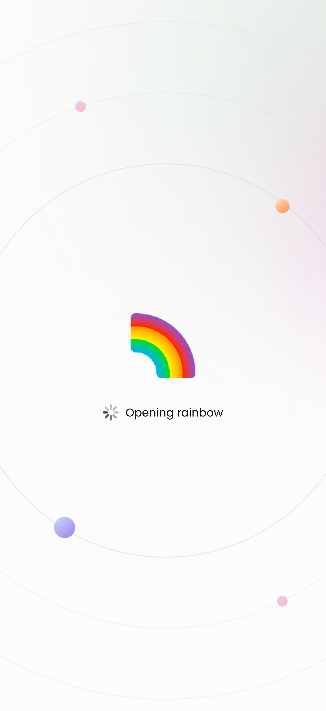
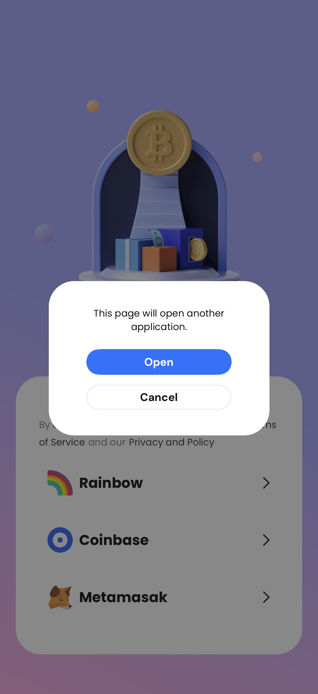
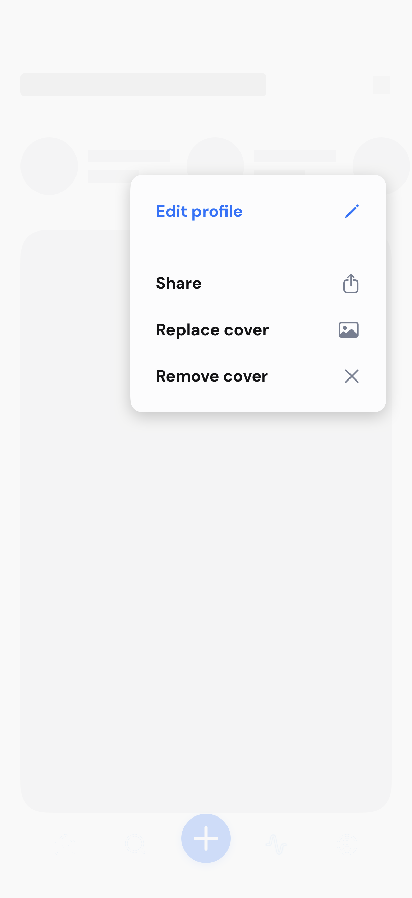
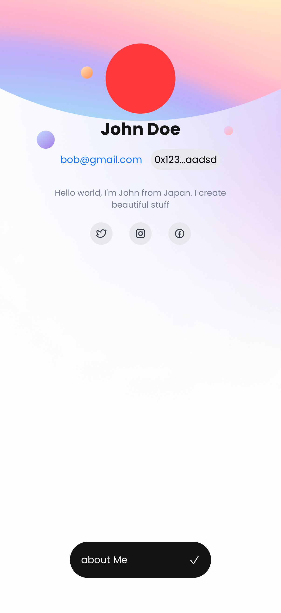
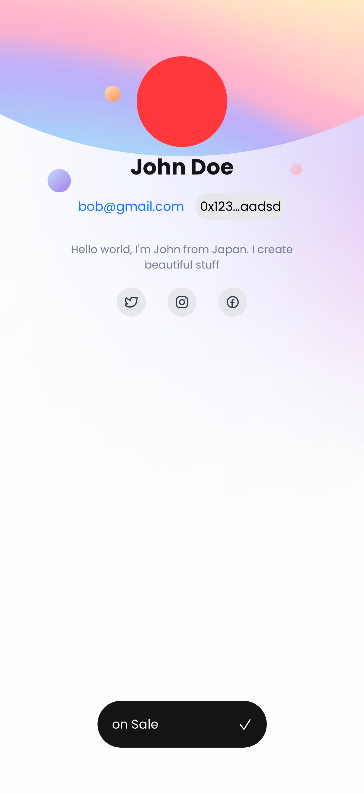
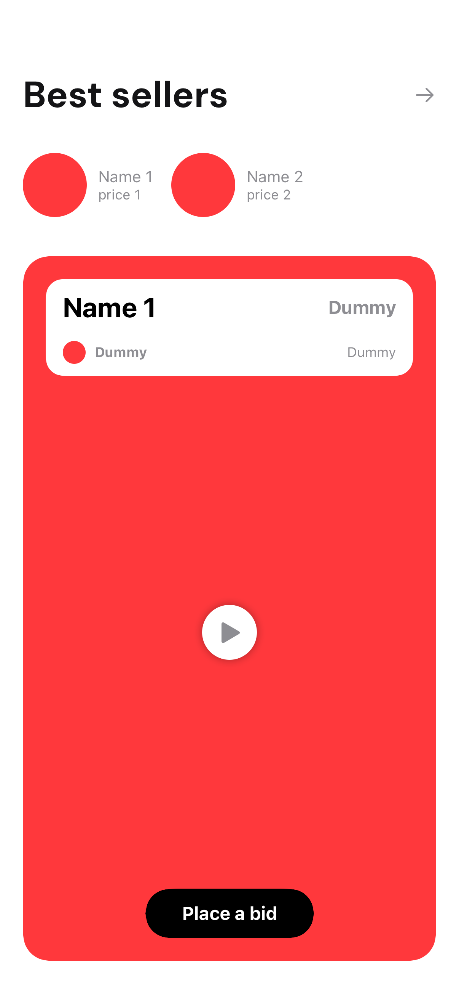
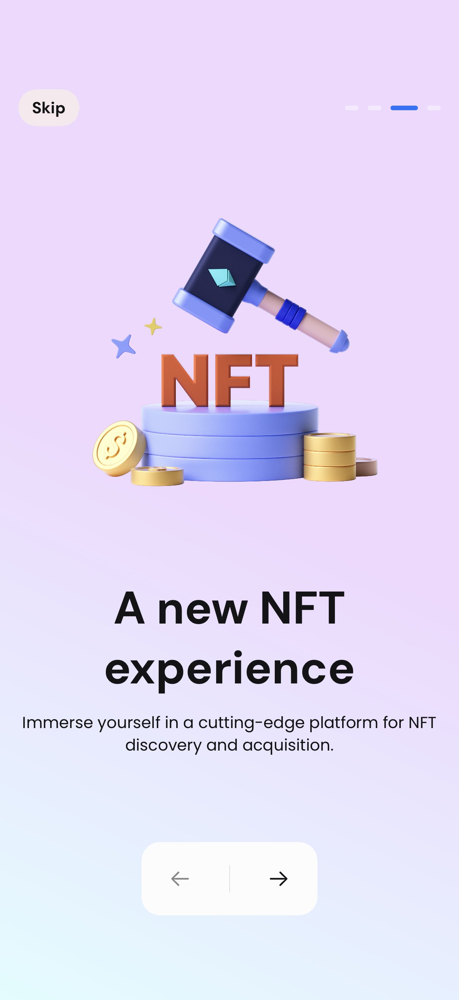
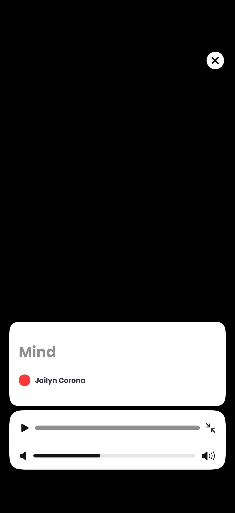

# 🎨 NodeCrypto - NFT Marketplace iOS App

> 🚀 A modern, feature-rich NFT marketplace iOS application built with SwiftUI and The Composable Architecture (TCA)

### 🎯 Core Functionality
- **🔍 Onboarding** - Get started quickly and explore all app features
- **🔍 NFT Discovery** - Browse and search through extensive NFT collections
- **👛 Wallet Integration** - Connect and manage multiple crypto wallets securely
- **🎨 NFT Creation** - Create your own NFTs with ease
- **👤 Profile** - Showcase your NFT collection and achievements
- **🔔 Notifications** - Stay updated with real-time alerts and updates

### 🌍 User Experience
- **🌐 Internationalization** - Full support for English and French languages
- **📱 Modern UI** - Beautiful SwiftUI interface with smooth animations

### 🔧 Architecture
- **🏗 Modular Architecture** 
- **The Composable Architecture (TCA)**
- **📊 Analytics Integration** - Firebase analytics for insights and monitoring
- **🚀 CI/CD Pipeline** - Automated builds and testing with Bitrise

## 📸 App Screenshots

<!-- SNAPSHOT_GALLERY_START -->
### 👛 Wallet Connection

| **Connect Wallet** | **Connect Wallet Alert** | **Connecting Wallet** |
| --- | --- | --- |
|  |  |  |

### 🎨 NFT Creation

| **Create View Empty** | **Create View Multiple Images Selected** | **Create View Next Button Disabled** | **Create View Next Button Enabled** | **Create View Single Image Selected** |
| --- | --- | --- | --- | --- |
|  |  |  |  |  |

| **Item Details View Default State** | **Item Details View Fixed Price** | **Item Details View Live Auction** | **Item Details View Put On Sale Disabled** | **Item Details View Unlock Once Purchased Enabled** |
| --- | --- | --- | --- | --- |
|  |  |  |  |  |

### 👤 Profile Features

| **Edit Profile Screen** | **Edit Menu Pressed** | **Loaded State About View** | **Loaded State On Sales View** | **Loading State** |
| --- | --- | --- | --- | --- |
|  |  |  |  |  |

### 🏠 Home Features

| **Initial Loading State** | **Received Response** |
| --- | --- |
|  |  |

### 🔔 Notifications

| **Notifications Empty** | **Notifications Loaded** | **Notifications Loading** |
| --- | --- | --- |
|  |  |  |

### 🎯 Onboarding

| **Page1** | **Page2** | **Page3** | **Page4** |
| --- | --- | --- | --- |
|  |  |  |  |

### 🎬 Player View

| **Player View Controls Hidden** | **Player View Controls Visible** | **Player View Paused** |
| --- | --- | --- |
|  |  |  |

### 🔍 Search Features

| **Initial State With Search History** | **Searching State With No Results** | **Searching State With Results** |
| --- | --- | --- |
|  |  |  |

<!-- SNAPSHOT_GALLERY_END -->

---

                                                                                                                                                                                                                                                              

